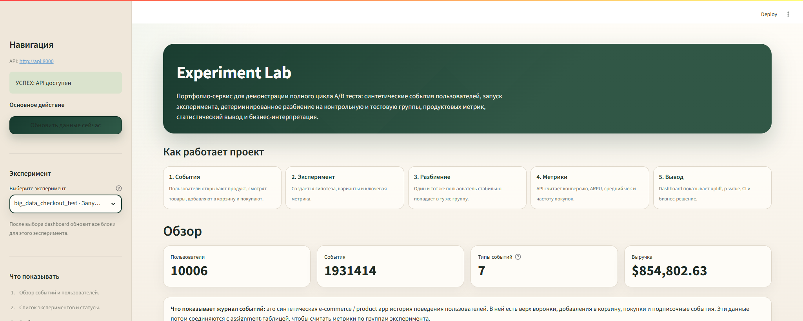
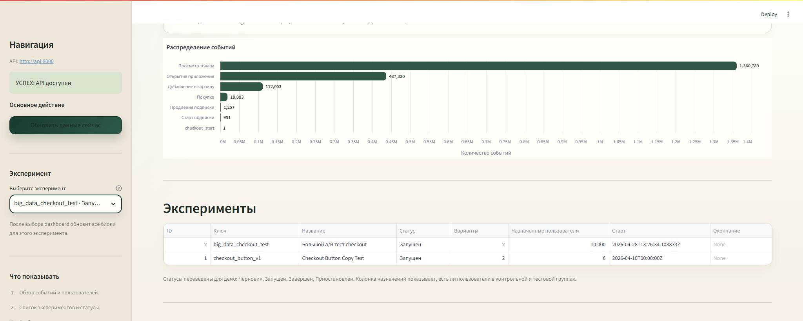
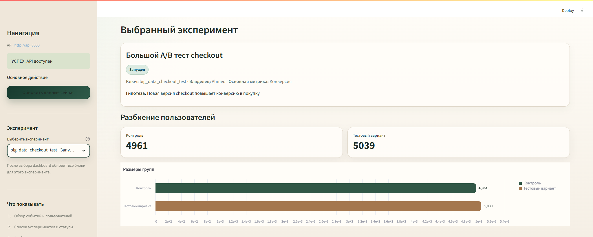
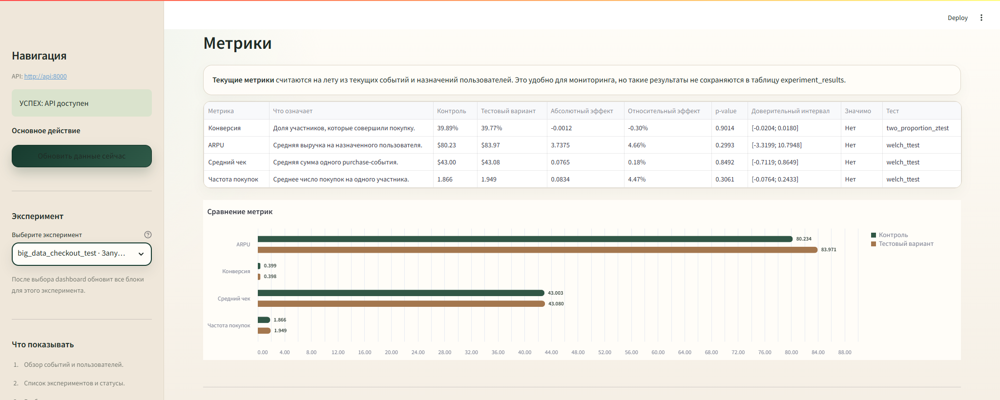
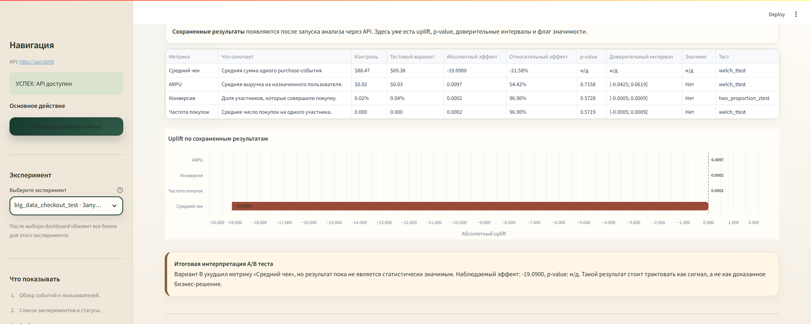

# Experiment Lab

Experiment Lab - это portfolio-ready сервис для демонстрации A/B тестов в
продуктовой аналитике. Проект показывает полный путь:

```text
пользователи и события -> эксперимент -> control/treatment assignment
-> метрики -> статистический анализ -> русский Streamlit dashboard
```

Проект рассчитан на Junior Data Scientist / Product Analyst / Data Analyst
позиции: он показывает не только анализ, но и инженерную упаковку вокруг
аналитики.

## Быстрый запуск демо

```bash
git clone https://github.com/TimoJR3/Experiment-Lab.git
cd Experiment-Lab
docker compose up --build -d
docker compose exec api python -m app.db.prepare_demo
```

После выполнения команды откройте:

| Что открыть | URL |
|---|---|
| Dashboard | `http://localhost:8501` |
| Swagger / FastAPI Docs | `http://localhost:8000/docs` |

В dashboard выберите эксперимент:

```text
big_data_checkout_test
```

Этот сценарий создает воспроизводимый demo sample:

- 10 000 synthetic users;
- большой журнал e-commerce/product events;
- demo-эксперимент `big_data_checkout_test`;
- deterministic assignment в контрольную и тестовую группы;
- сохраненные результаты анализа с uplift, p-value и confidence interval.

## Скриншоты dashboard

### Обзор проекта и demo data



### Распределение событий и список экспериментов



### Выбранный эксперимент и разбиение пользователей



### Метрики control и treatment



### Статистические результаты и итоговая интерпретация



## Что показывает проект

- PostgreSQL data model для users, events, experiments, variants,
  assignments, metric definitions и experiment results.
- Synthetic data generator с реалистичной воронкой: `app_open`, `view_item`,
  `add_to_cart`, `purchase`, `subscription_start`, `subscription_renewal`.
- Детерминированное hash-based назначение пользователей в группы.
- Metrics engine для conversion rate, ARPU, average order value и purchase rate.
- Базовый статистический анализ с uplift, p-value и доверительными интервалами.
- FastAPI backend с endpoint'ами для экспериментов, метрик и dashboard.
- Русский Streamlit dashboard для демонстрации результата работодателю.
- Docker Compose, pytest, GitHub Actions и MIT License.

## Стек

| Область | Инструменты |
|---|---|
| Backend | Python 3.11, FastAPI |
| Database | PostgreSQL |
| Analytics | pandas, SciPy, statsmodels |
| Dashboard | Streamlit, Altair |
| Infrastructure | Docker Compose |
| Quality | pytest, GitHub Actions |

## Архитектура

```text
Synthetic Data Generator
        |
        v
PostgreSQL <---- FastAPI Services <---- Streamlit Dashboard
        ^              |
        |              v
SQL Schema       Assignment + Metrics Engine
```

Ключевая идея: события и назначения в эксперимент хранятся отдельно. События
описывают поведение пользователей, а assignment-таблица описывает участие в
A/B тесте. Метрики считаются через соединение этих данных.

## Dashboard

Dashboard доступен по адресу:

```text
http://localhost:8501
```

В нем есть секции:

- **Обзор** - пользователи, события, типы событий и выручка.
- **Эксперименты** - список экспериментов и статусы на русском языке.
- **Выбранный эксперимент** - гипотеза, ключ, владелец и основная метрика.
- **Разбиение пользователей** - размеры контрольной и тестовой групп.
- **Метрики** - текущие метрики из events + assignments.
- **Статистические результаты** - uplift, p-value, CI и значимость.
- **Проверка демо** - pass/fail проверки API, данных и выбранного эксперимента.

Важное различие:

- `/metrics` считает текущие метрики на лету;
- `/results` читает сохраненные результаты из `experiment_results` после
  запуска `/analyze`.

## API

Swagger доступен по адресу:

```text
http://localhost:8000/docs
```

Основные endpoint'ы:

| Method | Endpoint | Назначение |
|---|---|---|
| `GET` | `/health` | Проверка API |
| `GET` | `/experiments` | Список экспериментов |
| `GET` | `/experiments/{id}` | Детали эксперимента |
| `GET` | `/experiments/{id}/assignments` | Размеры групп |
| `GET` | `/experiments/{id}/metrics` | Текущие метрики |
| `GET` | `/experiments/{id}/results` | Сохраненные результаты |
| `GET` | `/users/summary` | Сводка пользователей |
| `GET` | `/events/summary` | Сводка событий |
| `POST` | `/experiments` | Создать эксперимент |
| `POST` | `/experiments/{experiment_key}/start` | Назначить пользователей |
| `POST` | `/experiments/{experiment_key}/analyze` | Запустить анализ |

## Ручной локальный запуск

Если Docker не используется, нужен PostgreSQL на `localhost:5432`.

```bash
python -m venv .venv
.venv\Scripts\activate
pip install -r requirements.txt
copy .env.example .env

python -m app.db.init_db --schema --seed
python -m app.db.prepare_demo

uvicorn app.main:app --reload
streamlit run dashboard/app.py
```

## Тесты

```bash
python -m compileall app dashboard tests
pytest -q
```

Или:

```bash
make check
```

## Troubleshooting

Если API не запускается:

```bash
docker compose ps
docker compose logs api
```

Если порты `5432`, `8000` или `8501` уже заняты другим локальным проектом,
запустите Experiment Lab на альтернативных host-портах:

```powershell
$env:POSTGRES_HOST_PORT="5433"
$env:API_HOST_PORT="8001"
$env:DASHBOARD_HOST_PORT="8502"
docker compose up --build -d
docker compose exec api python -m app.db.prepare_demo
```

После этого откройте:

```text
Dashboard: http://localhost:8502
Swagger: http://localhost:8001/docs
```

Если в PowerShell команда `curl` работает не так, как ожидается, используйте:

```powershell
curl.exe http://localhost:8000/health
```

или:

```powershell
Invoke-RestMethod http://localhost:8000/health
```

Если в dashboard нет данных или нет эксперимента `big_data_checkout_test`,
повторно запустите:

```bash
docker compose exec api python -m app.db.prepare_demo
```

Если нужно полностью пересоздать базу:

```bash
docker compose down -v
docker compose up --build -d
docker compose exec api python -m app.db.prepare_demo
```

## Структура репозитория

```text
.
|-- app/
|   |-- api/              # FastAPI routes
|   |-- core/             # configuration
|   |-- db/               # DB connection, init, ingestion, demo setup
|   |-- experiments/      # assignment, metrics, synthetic data
|   |-- schemas/          # Pydantic schemas
|   `-- services/         # business services
|-- dashboard/            # Streamlit UI
|-- docs/                 # project documentation
|-- sql/                  # PostgreSQL schema and seed data
|-- tests/                # pytest suite
|-- docker-compose.yml
|-- Dockerfile
|-- Makefile
`-- README.md
```

## Документация

- [Architecture](docs/architecture.md)
- [Data Dictionary](docs/data_dictionary.md)
- [Synthetic Data Decisions](docs/decisions.md)
- [Experiment Flow](docs/experiment_flow.md)
- [Metrics and Statistics](docs/metrics.md)
- [Demo Checklist](docs/demo_checklist.md)
- [Resume Bullets](docs/resume_bullets.md)
- [Interview Story](docs/interview_story.md)

## Ограничения

- Synthetic data не заменяет production-данные.
- Assignment пока hash-based, без stratification и overlapping experiment checks.
- Нет SRM check, CUPED, sequential testing и multiple testing correction.
- Revenue metrics могут быть skewed, поэтому p-value нужно интерпретировать
  аккуратно.
- Dashboard сделан как portfolio MVP, а не как полноценная BI-система.

## License

MIT License. See [LICENSE](LICENSE).
