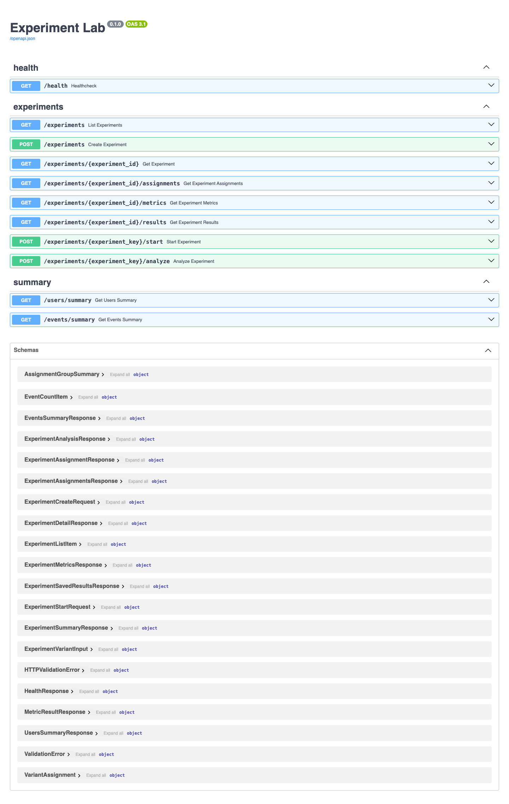
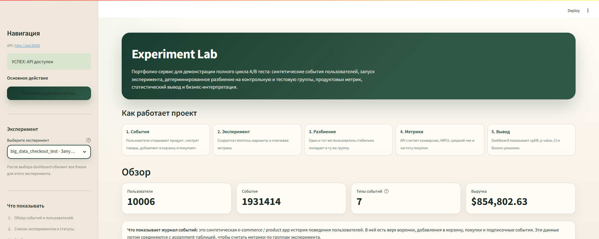
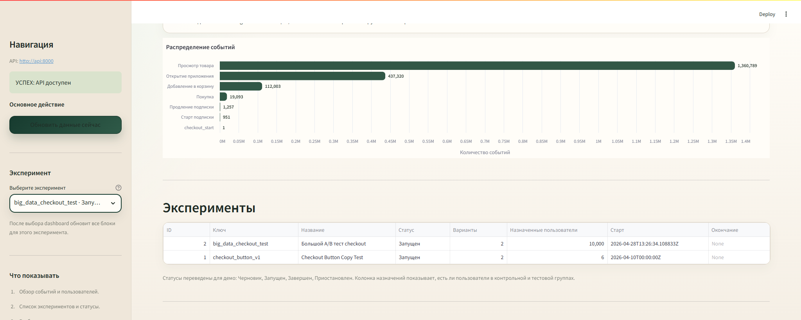
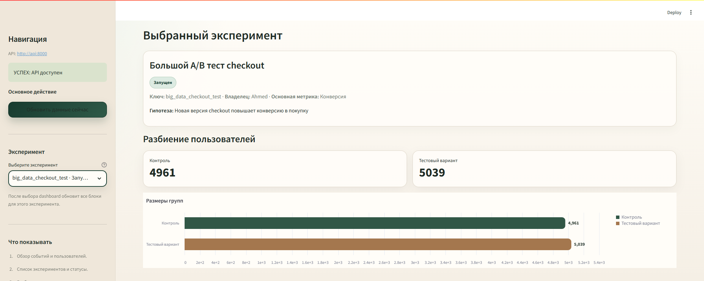
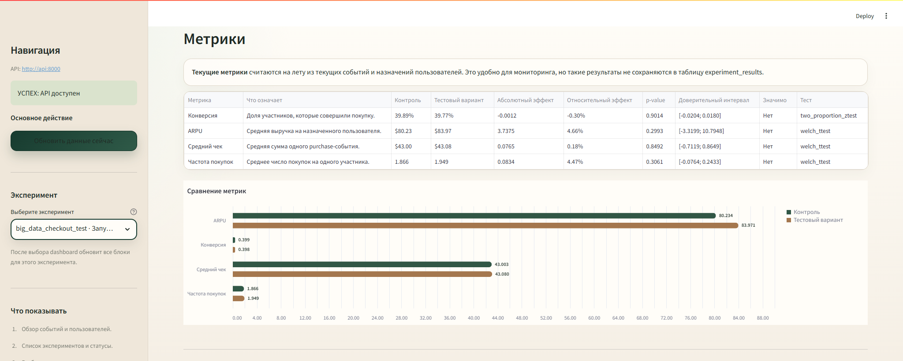
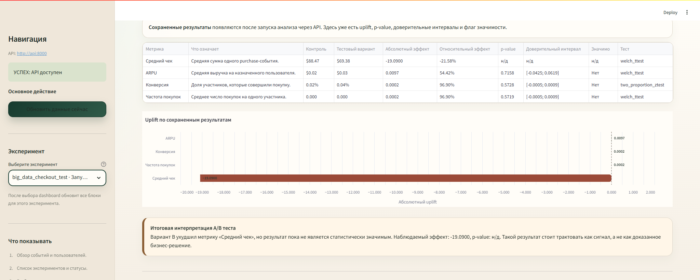

# Experiment Lab

## Обзор проекта

Experiment Lab — демонстрационный проект по A/B-тестированию для портфолио
Product/Data Analyst. Он показывает полный аналитический workflow на synthetic
users/events: от генерации событий и хранения в PostgreSQL до FastAPI API,
metrics engine и Streamlit dashboard.

Проект не притворяется реальной experimentation platform и не доказывает
реальный бизнес-эффект. Его цель — честно показать методику A/B-анализа,
структуру данных, расчет метрик и аккуратную интерпретацию результата.

Что демонстрирует проект:

- генерацию synthetic users и событий e-commerce/product app;
- хранение users, events, experiments, variants, assignments и results в PostgreSQL;
- deterministic assignment пользователей в `control` и `treatment`;
- расчет `conversion_rate`, ARPU, AOV и `purchase_rate`;
- расчет uplift, `p_value` и confidence interval;
- выдачу данных через FastAPI;
- русскоязычный Streamlit dashboard, который получает данные через API.

## Контекст эксперимента

Demo-сценарий — checkout funnel в e-commerce / product app. Пользователь может:

- открыть приложение;
- посмотреть товар;
- добавить товар в корзину;
- совершить покупку;
- начать подписку;
- продлить подписку.

Продуктовая задача: понять, помогает ли новая версия checkout улучшить
покупательское поведение. В демо это показано на эксперименте:

```text
big_data_checkout_test
```

## Пример гипотезы

```text
Если изменить checkout experience, пользователи будут чаще завершать покупку,
а ключевая метрика conversion_rate вырастет.
```

Гипотеза специально простая: она понятна бизнесу, проверяема через события и
связана с конкретной метрикой.

## Дизайн эксперимента

В проекте есть две группы:

| Группа | Что означает |
|---|---|
| `control` | Текущая версия checkout |
| `treatment` | Тестовая версия checkout |

Assignment устроен deterministic:

- берется пара `experiment_key:user_id`;
- считается hash;
- hash переводится в bucket от 0 до 100;
- bucket попадает в диапазон `control` или `treatment`;
- результат сохраняется в `experiment_assignments`.

Почему это важно: один и тот же пользователь должен оставаться в одной группе
при повторном расчете. Иначе метрики могут меняться не из-за продукта, а из-за
нестабильного assignment.

Для demo-эксперимента используется сплит:

```text
control: 50%
treatment: 50%
```

## Метрики

В проекте реализованы четыре продуктовые метрики и несколько статистических
полей для интерпретации.

| Поле | Простое объяснение | Зачем аналитику |
|---|---|---|
| `conversion_rate` | Доля назначенных пользователей, которые сделали хотя бы одну покупку | Проверить, увеличивает ли treatment вероятность покупки |
| `average_revenue_per_user` / ARPU | Средняя выручка на назначенного пользователя | Понять, растет ли денежная отдача на пользователя |
| `average_order_value` / AOV | Средняя сумма одного `purchase` события | Проверить, не меняется ли средний чек |
| `purchase_rate` | Среднее число покупок на назначенного пользователя | Оценить частоту покупок |
| `absolute_lift` | `treatment - control` | Показать размер эффекта в абсолютных единицах |
| `relative_lift` | `(treatment - control) / control` | Показать относительное изменение |
| `p_value` | Насколько наблюдаемая разница совместима с нулевой гипотезой | Оценить статистическую убедительность |
| `confidence_interval` | Диапазон неопределенности для эффекта | Понять, насколько точна оценка |

### Conversion rate

Conversion rate — доля пользователей, которые совершили целевое действие. В
этом проекте целевое действие — `purchase`.

```text
conversion_rate = users_with_purchase / assigned_users
```

### ARPU

ARPU показывает среднюю выручку на назначенного пользователя. Пользователи без
покупок входят в знаменатель с revenue = 0.

```text
ARPU = total_purchase_revenue / assigned_users
```

### AOV

AOV показывает средний чек среди purchase-событий. Это order-level метрика:
sample size для AOV равен количеству покупок, а не количеству пользователей.

```text
AOV = total_purchase_revenue / purchase_events
```

### Purchase rate

Purchase rate показывает среднее число покупок на назначенного пользователя.
Она отличается от conversion rate: пользователь с тремя покупками влияет на
purchase rate сильнее, но в conversion rate все равно считается как `1`.

```text
purchase_rate = purchase_events / assigned_users
```

### Uplift

Uplift показывает, насколько treatment отличается от control.

```text
absolute uplift = treatment_metric - control_metric
relative uplift = (treatment_metric - control_metric) / control_metric
```

Если значение control равно нулю, relative uplift не считается, чтобы не делить
на ноль.

### P-value

P-value не означает “вероятность, что treatment победил”. В проекте p-value
используется как показатель того, насколько наблюдаемая разница совместима с
нулевой гипотезой, где эффекта между группами нет.

### Confidence interval

Confidence interval показывает диапазон возможных значений эффекта с учетом
статистической неопределенности. Если интервал для разницы treatment-control
пересекает 0, направление эффекта нельзя считать устойчивым.

### Statistical significance

В проекте результат считается statistically significant, если `p_value < 0.05`.
Это учебное правило для demo-проекта. В реальной аналитике дополнительно нужно
смотреть на дизайн эксперимента, качество данных, размер эффекта и ограничения.

## Почему нельзя смотреть только на p-value

P-value отвечает на узкий статистический вопрос, но не закрывает продуктовую
интерпретацию. Даже маленький p-value может сопровождаться эффектом, который
слишком мал для бизнеса. И наоборот, большой p-value не доказывает отсутствие
эффекта: данных могло быть мало, а confidence interval мог быть слишком широким.

Для решения аналитику нужно смотреть вместе:

- направление эффекта: treatment лучше или хуже control;
- размер эффекта: `absolute_lift` и `relative_lift`;
- неопределенность: `ci_lower` и `ci_upper`;
- качество дизайна: группы, assignment, окно наблюдения, выбросы;
- бизнес-контекст: стоит ли эффект внедрения и возможных рисков.

## Как интерпретировать результат A/B-теста

1. Проверить, что у эксперимента есть назначенные пользователи в control и
   treatment.
2. Посмотреть primary metric, например `conversion_rate`.
3. Сравнить `baseline_value` и `compared_value`.
4. Оценить `absolute_lift` и `relative_lift`: важен не только знак, но и размер.
5. Проверить `p_value` и confidence interval.
6. Если confidence interval пересекает 0, вывод о направлении эффекта слабый.
7. Если результат statistically significant, все равно проверить бизнес-смысл,
   ограничения данных и возможные guardrail-метрики.
8. Сформулировать вывод аккуратно: “на synthetic data treatment показывает...”,
   а не “новый checkout точно улучшит бизнес”.

## Статистические методы

В проекте используются базовые и объяснимые методы:

| Тип метрики | Метод |
|---|---|
| Бинарная метрика `conversion_rate` | two-proportion z-test |
| Числовые метрики ARPU, AOV, purchase rate | Welch t-test |
| Интервалы | 95% confidence interval для разницы treatment-control |

Почему так: для intern/junior проекта важнее показать корректную базовую
логику и честную интерпретацию, чем добавлять сложные методы без необходимости.

## Архитектура проекта

```text
synthetic events
      |
      v
PostgreSQL
  users, events, experiments, variants, assignments, metrics, results
      |
      v
FastAPI
  health, experiments, assignments, metrics, results, summaries
      |
      v
Streamlit dashboard
  русскоязычная визуальная демонстрация A/B-теста
```

Metrics engine находится в `app/experiments/metrics.py`: он агрегирует данные по
назначенным пользователям, считает метрики, uplift, p-value и confidence
interval. Dashboard получает данные через FastAPI и не обращается к PostgreSQL
напрямую.

Подробнее: [docs/architecture.md](docs/architecture.md).

## API и примеры запросов

FastAPI Swagger доступен после запуска API:

```text
http://localhost:8000/docs
```

В Swagger можно посмотреть все маршруты, схемы request/response и выполнить
запросы из браузера. Если screenshot Swagger еще не создан, запустите API,
откройте `http://localhost:8000/docs`, сделайте screenshot страницы и сохраните
его как `docs/images/swagger_api.png`.



Ниже показаны основные endpoints из `app/api/routes.py`. Примеры ответов
сокращены, но сохраняют реальные поля API.

Для dashboard также есть вспомогательные summary endpoints:

- `GET /users/summary` — компактная сводка по synthetic users;
- `GET /events/summary` — компактная сводка по synthetic events и revenue.

### GET /health

```bash
curl http://localhost:8000/health
```

```json
{
  "status": "ok"
}
```

Зачем аналитику: быстро проверить, что backend доступен перед работой с
dashboard или API-запросами.

### GET /experiments

```bash
curl http://localhost:8000/experiments
```

```json
[
  {
    "id": 1,
    "experiment_key": "big_data_checkout_test",
    "name": "Big Data Checkout Test",
    "status": "running",
    "start_at": "2026-04-10T09:00:00Z",
    "end_at": null,
    "variants_count": 2,
    "assignments_count": 250
  }
]
```

Зачем аналитику: выбрать эксперимент для анализа и сразу увидеть статус,
количество вариантов и число назначенных пользователей.

### GET /experiments/{id}

```bash
curl http://localhost:8000/experiments/1
```

```json
{
  "id": 1,
  "experiment_key": "big_data_checkout_test",
  "name": "Big Data Checkout Test",
  "description": "Synthetic checkout experiment for product analytics demo.",
  "hypothesis": "New checkout experience improves purchase conversion.",
  "status": "running",
  "start_at": "2026-04-10T09:00:00Z",
  "end_at": null,
  "owner_name": "Product Analytics Demo",
  "primary_metric_key": "conversion_rate",
  "created_at": "2026-04-10T09:00:00Z",
  "updated_at": "2026-04-10T09:00:00Z"
}
```

Зачем аналитику: проверить гипотезу, primary metric, владельца и контекст
эксперимента перед чтением результатов.

### GET /experiments/{id}/assignments

```bash
curl http://localhost:8000/experiments/1/assignments
```

```json
{
  "experiment_id": 1,
  "total_assigned": 250,
  "groups": [
    {
      "variant_id": 1,
      "variant_key": "control",
      "is_control": true,
      "users_count": 126
    },
    {
      "variant_id": 2,
      "variant_key": "treatment",
      "is_control": false,
      "users_count": 124
    }
  ]
}
```

Зачем аналитику: оценить размеры групп и заметить грубый перекос assignment до
интерпретации метрик.

### GET /experiments/{id}/metrics

```bash
curl http://localhost:8000/experiments/1/metrics
```

```json
{
  "experiment_id": 1,
  "results": [
    {
      "metric_key": "conversion_rate",
      "metric_name": "Conversion Rate",
      "baseline_variant_key": "control",
      "compared_variant_key": "treatment",
      "sample_size_baseline": 126,
      "sample_size_compared": 124,
      "baseline_value": 0.1746,
      "compared_value": 0.2097,
      "absolute_lift": 0.0351,
      "relative_lift": 0.201,
      "p_value": 0.48,
      "ci_lower": -0.061,
      "ci_upper": 0.131,
      "is_significant": false,
      "test_method": "two_proportion_ztest"
    }
  ]
}
```

Зачем аналитику: получить live-расчет метрик по текущим assignments и events без
сохранения нового результата в `experiment_results`.

### GET /experiments/{id}/results

```bash
curl http://localhost:8000/experiments/1/results
```

```json
{
  "experiment_id": 1,
  "results": [
    {
      "metric_key": "average_revenue_per_user",
      "metric_name": "Average Revenue Per User",
      "baseline_variant_key": "control",
      "compared_variant_key": "treatment",
      "sample_size_baseline": 126,
      "sample_size_compared": 124,
      "baseline_value": 18.42,
      "compared_value": 20.15,
      "absolute_lift": 1.73,
      "relative_lift": 0.0939,
      "p_value": 0.37,
      "ci_lower": -2.04,
      "ci_upper": 5.50,
      "is_significant": false,
      "test_method": "welch_ttest"
    }
  ]
}
```

Зачем аналитику: посмотреть сохраненный результат анализа, который dashboard
может показывать без повторной записи в таблицу результатов.

### POST /experiments

```bash
curl -X POST http://localhost:8000/experiments \
  -H "Content-Type: application/json" \
  -d '{
    "experiment_key": "checkout_copy_v2",
    "name": "Checkout Copy Test",
    "description": "Demo draft experiment for checkout copy.",
    "hypothesis": "Clearer checkout copy improves purchase conversion.",
    "owner_name": "Product Analytics Demo",
    "primary_metric_key": "conversion_rate",
    "variants": [
      {
        "variant_key": "control",
        "name": "Current copy",
        "description": "Existing checkout copy.",
        "is_control": true,
        "allocation_percent": "50"
      },
      {
        "variant_key": "treatment",
        "name": "New copy",
        "description": "Updated checkout copy.",
        "is_control": false,
        "allocation_percent": "50"
      }
    ]
  }'
```

```json
{
  "experiment_id": 2,
  "experiment_key": "checkout_copy_v2",
  "name": "Checkout Copy Test",
  "status": "draft",
  "created_at": "2026-07-04T10:00:00Z"
}
```

Зачем аналитику: создать карточку эксперимента, варианты и primary metric до
назначения пользователей.

### POST /experiments/{experiment_key}/start

```bash
curl -X POST http://localhost:8000/experiments/checkout_copy_v2/start \
  -H "Content-Type: application/json" \
  -d '{
    "user_ids": [1, 2, 3, 4, 5],
    "assignment_source": "hash"
  }'
```

```json
{
  "experiment_id": 2,
  "experiment_key": "checkout_copy_v2",
  "status": "running",
  "assigned_users": 5,
  "assignments": [
    {
      "user_id": 1,
      "variant_id": 3,
      "variant_key": "control",
      "assignment_bucket": "12.345678"
    },
    {
      "user_id": 2,
      "variant_id": 4,
      "variant_key": "treatment",
      "assignment_bucket": "76.543210"
    }
  ]
}
```

Зачем аналитику: зафиксировать попадание пользователей в control/treatment,
чтобы дальше считать метрики по стабильному assignment.

### POST /experiments/{experiment_key}/analyze

```bash
curl -X POST http://localhost:8000/experiments/big_data_checkout_test/analyze
```

```json
{
  "experiment_key": "big_data_checkout_test",
  "results_saved": 4,
  "results": [
    {
      "metric_key": "conversion_rate",
      "metric_name": "Conversion Rate",
      "baseline_variant_key": "control",
      "compared_variant_key": "treatment",
      "sample_size_baseline": 126,
      "sample_size_compared": 124,
      "baseline_value": 0.1746,
      "compared_value": 0.2097,
      "absolute_lift": 0.0351,
      "relative_lift": 0.201,
      "p_value": 0.48,
      "ci_lower": -0.061,
      "ci_upper": 0.131,
      "is_significant": false,
      "test_method": "two_proportion_ztest"
    }
  ]
}
```

Зачем аналитику: пересчитать все поддержанные метрики, применить статистические
тесты и сохранить результат в PostgreSQL для последующей демонстрации.

PowerShell иногда использует alias `curl`. Если команда ведет себя не так,
используйте:

```powershell
curl.exe http://localhost:8000/health
Invoke-RestMethod http://localhost:8000/health
```

## Dashboard и скриншоты

Dashboard запускается через Streamlit и показывает весь experiment flow:
overview -> список экспериментов -> выбранный эксперимент -> группы ->
метрики -> статистический вывод.

### 1. Обзор проекта и synthetic event log



Что показано: количество пользователей, событий, типов событий и выручка.

Как связано с experiment flow: это стартовая точка анализа — перед A/B-тестом
аналитик должен понимать, какие данные доступны.

Почему важно для аналитика: без проверки объема и природы данных нельзя
доверять последующим метрикам.

### 2. Распределение событий и список экспериментов



Что показано: event distribution и таблица экспериментов.

Как связано с experiment flow: события дают основу для расчета метрик, а список
экспериментов показывает, какие тесты можно анализировать.

Почему важно для аналитика: видно, что данные не являются одним случайным
числом, а похожи на воронку поведения пользователей.

### 3. Выбранный эксперимент и разбиение пользователей



Что показано: гипотеза, ключ эксперимента, статус, owner и размеры групп.

Как связано с experiment flow: это этап control/treatment assignment.

Почему важно для аналитика: размеры групп позволяют быстро увидеть, есть ли
данные для сравнения и нет ли очевидного перекоса.

### 4. Сравнение метрик control и treatment



Что показано: conversion rate, ARPU, AOV, purchase rate, uplift и p-value по
метрикам.

Как связано с experiment flow: это основная аналитическая часть A/B-теста —
сравнение групп по заранее выбранным метрикам.

Почему важно для аналитика: можно увидеть не только направление эффекта, но и
его размер.

### 5. Статистические результаты и итоговая интерпретация



Что показано: сохраненные результаты анализа, p-value, confidence interval,
significance flag и итоговый текстовый вывод.

Как связано с experiment flow: это финальный этап — интерпретация результата и
ограничений.

Почему важно для аналитика: задача аналитика не заканчивается расчетом метрик;
нужно объяснить, насколько результат надежен и можно ли использовать его для
решения.

## Как запустить локально

### Быстрый запуск через Docker Compose

```bash
git clone https://github.com/TimoJR3/Experiment-Lab.git
cd Experiment-Lab
cp .env.example .env
docker compose up --build -d
docker compose exec api python -m app.db.prepare_demo
```

Открыть:

| Сервис | URL |
|---|---|
| Streamlit dashboard | `http://localhost:8501` |
| FastAPI Swagger | `http://localhost:8000/docs` |

В dashboard выберите:

```text
big_data_checkout_test
```

### Если порт PostgreSQL занят

```powershell
Copy-Item .env.example .env
$env:POSTGRES_HOST_PORT="5433"
$env:API_HOST_PORT="8001"
$env:DASHBOARD_HOST_PORT="8502"
docker compose up --build -d
docker compose exec api python -m app.db.prepare_demo
```

После этого:

```text
Dashboard: http://localhost:8502
Swagger: http://localhost:8001/docs
```

### Локальный запуск без Docker

Нужен запущенный PostgreSQL.

```bash
python -m venv .venv
source .venv/bin/activate
pip install -r requirements.txt
cp .env.example .env

python -m app.db.init_db --schema --seed
python -m app.db.prepare_demo

uvicorn app.main:app --reload
streamlit run dashboard/app.py
```

## Структура репозитория

```text
.
├── app/
│   ├── api/             # FastAPI routes
│   ├── core/            # настройки приложения
│   ├── db/              # подключение к БД, init, ingestion, prepare_demo
│   ├── experiments/     # assignment, synthetic data, metrics engine
│   ├── schemas/         # Pydantic schemas
│   └── services/        # сервисный слой экспериментов, метрик и dashboard
├── dashboard/           # Streamlit dashboard
├── docs/                # документация и screenshots
├── sql/                 # PostgreSQL schema и seed data
├── tests/               # pytest tests
├── docker-compose.yml
├── Dockerfile
├── requirements.txt
└── README.md
```

## Ограничения synthetic data

- Данные synthetic и не отражают реальный трафик.
- Проект не доказывает реальный бизнес-эффект.
- Demo-сценарий сфокусирован на checkout и purchase behavior.
- События сгенерированы по заданным вероятностям, а не собраны из продукта.
- Assignment hash-based, без стратификации.
- Нет SRM check.
- Нет power analysis и расчета минимального размера выборки.
- Нет CUPED.
- Нет sequential testing.
- Нет коррекции на multiple testing.
- Revenue-метрики могут быть скошенными, поэтому p-value нужно трактовать
  осторожно.
- Dashboard создан для демонстрации аналитического workflow, а не как замена BI.

## Проверки

```bash
python -m compileall app dashboard tests
pytest -q
ruff check .
docker compose config
```

## GitHub-подача

Описание репозитория:

```text
Демонстрационный проект по A/B-тестированию с расчетом продуктовых метрик, статистической интерпретацией, FastAPI, PostgreSQL и Streamlit.
```

Topics:

```text
product-analytics, ab-testing, python, fastapi, postgresql, streamlit, statistics, uplift, confidence-intervals
```

## Документация

- [Продуктовый кейс](docs/product_case.md)
- [Заметки для собеседования](docs/interview_notes.md)
- [Архитектура](docs/architecture.md)
- [Заметки по A/B-тестированию](docs/ab_testing_notes.md)
- [Словарь данных](docs/data_dictionary.md)
- [Решения по synthetic data](docs/decisions.md)
- [Жизненный цикл эксперимента](docs/experiment_flow.md)
- [Метрики и статистика](docs/metrics.md)
- [Demo checklist](docs/demo_checklist.md)
- [Bullets для резюме](docs/resume_bullets.md)

## License

MIT License. См. [LICENSE](LICENSE).
