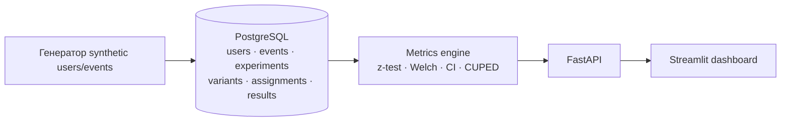

# Experiment Lab — анализ A/B-тестов от дизайна до вывода

[](https://github.com/TimoJR3/Experiment-Lab/actions/workflows/ci.yml)


Сервис, который проводит эксперимент по всему циклу: **расчёт размера выборки →
детерминированный сплит → проверка SRM → метрики и статистические тесты →
вывод для продукта**. Данные синтетические (checkout в e-commerce), поэтому проект
показывает методику, а не реальный бизнес-эффект.

**Роль:** Product / Data Analyst · **Стек:** Python, SciPy, statsmodels,
PostgreSQL, FastAPI, Streamlit, pytest, Docker, GitHub Actions


## Что умеет

| Этап | Что считается | Где в коде |
|---|---|---|
| Дизайн | размер выборки, мощность, MDE для конверсии | `app/experiments/design.py` |
| Сплит | детерминированный hash `experiment_key:user_id` → bucket 0–99 | `app/experiments/assignment.py` |
| Валидность | SRM: χ²-тест фактического разбиения против плана (порог 0,001) | `app/experiments/design.py` |
| Метрики | `conversion_rate`, ARPU, AOV, `purchase_rate`, uplift | `app/experiments/metrics.py` |
| Тесты | z-тест для долей, t-тест Уэлча, 95% доверительные интервалы | `app/experiments/metrics.py` |
| Снижение дисперсии | CUPED по ковариате до эксперимента | `app/experiments/design.py` |
| Множественные сравнения | поправка Холма для нескольких метрик и вариантов | `app/experiments/design.py` |

## Пример: сколько трафика нужно

Базовая конверсия в оплату 13,4%, α = 0,05, мощность 80%, сплит 50/50:

| Хотим заметить рост | Конверсия treatment | Пользователей на группу | Всего |
|---|---:|---:|---:|
| +3% (относительно) | 13,80% | 114 144 | 228 288 |
| +5% | 14,07% | 41 430 | 82 860 |
| +10% | 14,74% | 10 566 | 21 132 |

Обратная задача: при 75 000 пользователей на группу минимально заметный эффект
(MDE) — около +3,7%. Если ожидаемый эффект меньше, тест не стоит запускать в таком
виде: нужно больше трафика, более чувствительная метрика или CUPED.

```bash
curl -X POST http://localhost:8000/design/sample-size \
  -H "Content-Type: application/json" \
  -d '{"baseline_rate": 0.134, "mde_relative": 0.05}'
```

## Как читаю результат

1. **SRM.** Если разбиение не совпадает с планом (p < 0,001), метрики не
   интерпретирую: сначала ищу ошибку в сплите или логировании.
2. **Главная метрика.** Смотрю на размер эффекта и доверительный интервал, а не
   только на p-value. Если интервал пересекает 0, направление эффекта не доказано.
3. **Деньги.** ARPU и AOV скошены, поэтому для них t-тест Уэлча и осторожная
   трактовка; CUPED сужает интервал, если есть метрика до эксперимента.
4. **Несколько метрик.** Решение принимаю по заранее выбранной главной метрике;
   для остальных применяю поправку Холма.
5. **Бизнес-смысл.** Статистически значимый, но маленький эффект может не окупить
   внедрение.

Подробнее: [заметки по A/B-тестам](docs/ab_testing_notes.md),
[метрики и формулы](docs/metrics.md).

## Архитектура


```mermaid
flowchart LR
    G["Генератор synthetic users/events"] --> DB[("PostgreSQL<br/>users · events · experiments<br/>variants · assignments · results")]
    DB --> E["Metrics engine<br/>z-test · Welch · CI · CUPED"]
    E --> API["FastAPI"]
    API --> D["Streamlit dashboard"]
```

Dashboard читает данные только через API. Все эндпоинты с примерами запросов и
ответов: [docs/api.md](docs/api.md).

| Обзор данных | Метрики control vs treatment |
|---|---|
|  |  |

## Запуск

```bash
git clone https://github.com/TimoJR3/Experiment-Lab.git
cd Experiment-Lab
cp .env.example .env
docker compose up --build -d
docker compose exec api python -m app.db.prepare_demo
```

- Dashboard: `http://localhost:8501` (эксперимент `big_data_checkout_test`)
- Swagger: `http://localhost:8000/docs`

Проверки (то же запускает CI):

```bash
pip install -r requirements.txt
pytest -q
ruff check .
```

## Ограничения

- Данные синтетические: события сгенерированы по заданным вероятностям.
- Нет последовательного тестирования (sequential testing), поэтому «подглядывать»
  в результат до набора выборки нельзя.
- Сплит без стратификации.

## Структура

```text
app/experiments/   дизайн эксперимента, сплит, метрики, генератор данных
app/api/           FastAPI-маршруты
app/services/      сервисный слой
dashboard/         Streamlit
sql/               схема PostgreSQL
tests/             pytest: статистика, API, сервисы
docs/              API, архитектура, словарь данных, решения
```

## Документация

- [Продуктовый кейс](docs/product_case.md)
- [API](docs/api.md)
- [Архитектура](docs/architecture.md)
- [Жизненный цикл эксперимента](docs/experiment_flow.md)
- [Словарь данных](docs/data_dictionary.md)
- [Решения по данным](docs/decisions.md)

## License

MIT
